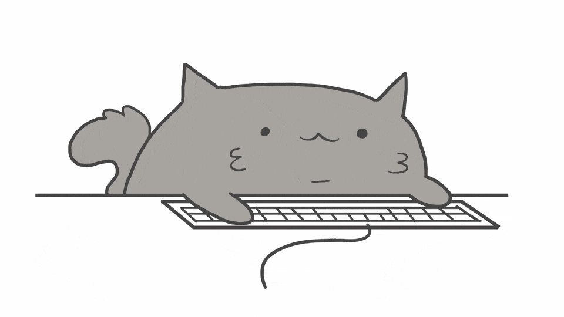

<h1 align="center"></h1>
<h2 align="center">Меня зовут Наталья. Я frontend разработчик 

</h2>

### Стек технологий: 

    &nbsp;
    &nbsp;
    &nbsp;
    
    
    
    
    &nbsp;
    
    &nbsp;
    &nbsp;
    
    
    
    
    
    
    
    
    
    
    
    

---

<h3 align="center">  Немного обо мне:</h3>

:computer: **Профессиональная деятельность:**

С августа 2023 года работаю в компании [Сектор бизнеса](https://sector.business/). Занимаюсь разработкой веб-приложений с использованием современных технологий, рефакторингом и оптимизацией существующего кода, а также добавлением нового функционала.

:dart: **Мои цели:**

Стать высококвалифицированным специалистом и ценным членом команды, чтобы вносить значительный вклад в успех компании, эффективно решая любые поставленные задачи. 

:checkered_flag: Я открыта к предложениям на позицию frontend-разработчика, где смогу применить свои навыки и экспертизу для достижения общих целей, участвовать в интересных и сложных проектах, способствующих моему профессиональному развитию.

#### :globe_with_meridians: **Контакты**:

:email: natka-31@mail.ru  
:telephone: +79612072195  
 @MaxiNata

---

   

